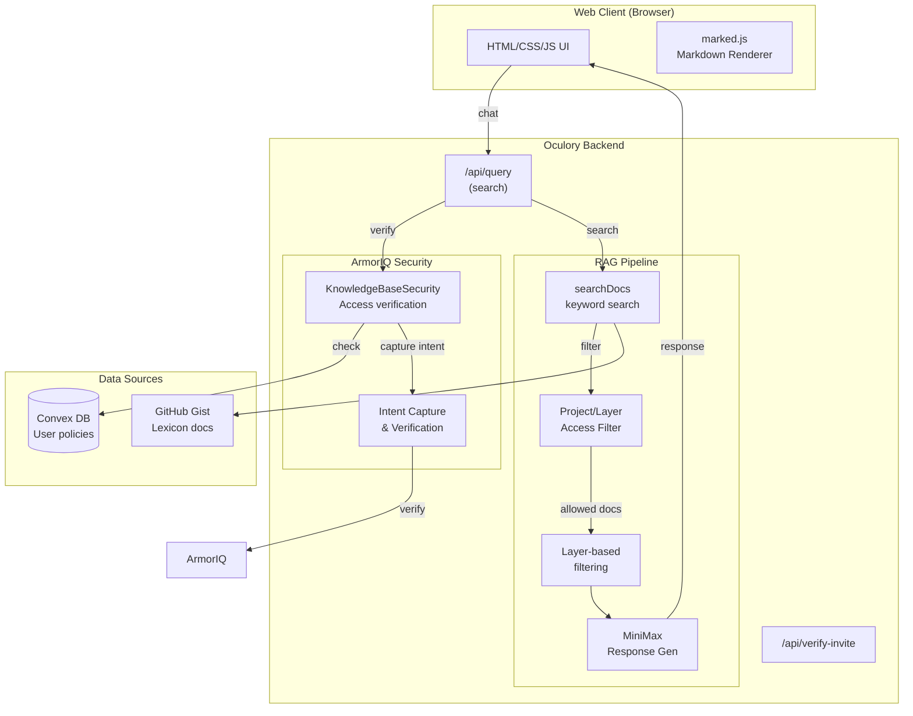

# Oculory Architecture

Secure knowledge base sharing with friend access control.

## Overview

Oculory is a secure Q&A system that allows you to share your Lexicon knowledge base with friends. Users can interact via text chat, getting responses backed by a RAG pipeline with ArmorIQ-powered access control.

## System Diagram



## Components

| Component | Role |
|-----------|------|
| **Web Client** | Invite code → chat UI with text input. Renders markdown. |
| **RAG Pipeline** | Search docs → filter by access → rank by layer priority → MiniMax generates response |
| **MiniMax** | Generates detailed markdown answer |
| **ArmorIQ** | Security layer - verifies user identity, captures search intent, prevents unauthorized access |
| **Convex** | Stores user policies, invites, and access permissions |
| **Gist** | Private GitHub gist stores Lexicon documents as JSON |

## Access Control Model

### Two Dimensions of Access

1. **Project Access** - Which knowledge base projects a user can access
   - `personal` - Personal knowledge
   - `work` - Work-related knowledge
   - `shared` - Shared with specific friends

2. **Layer Access** - Which layers within projects a user can see
   - `memory` (priority 1) - Most sensitive
   - `people` (priority 2) - Contact information
   - `meeting` (priority 3) - Meeting notes
   - `metadata` (priority 4) - General metadata
   - `transcript` (priority 5) - Transcripts

### ArmorIQ Integration

ArmorIQ provides **intent-based execution** with cryptographic verification:

1. **Plan Capture** - When a user searches, the intent is captured as a verified plan
2. **Action Verification** - Every search is verified against the captured intent
3. **Prompt Injection Prevention** - Malicious prompts cannot execute unplanned actions
4. **Rate Limiting** - Per-user rate limits enforced by policy

## Data Flow

1. **User submits query** (text via input)
2. **Verify invite** - Check invite code is valid and not expired
3. **ArmorIQ check** - Validate user can search for this query
4. **Filter by access** - Remove documents from disallowed projects/layers
5. **Search** - keyword match against allowed docs, scored by layer priority
6. **Generate** - MiniMax receives context (top 5 docs, 1500 chars each)
7. **Return** - `response` for chat display

## Layer Priority (RAG)

```
Memory (0) → People (1) → Meetings (2) → Metadata (3) → Transcripts (4)
```

Higher layers (lower numbers) are preferred in search results. Documents in earlier layers are ranked higher when scoring matches.

## APIs

| Endpoint | Method | Purpose |
|----------|--------|---------|
| `/` | GET | Serve HTML UI |
| `/api/verify-invite` | POST | Validate invite code |
| `/api/query` | POST | Search - returns `{response, sources}` |
| `/api/invite/create` | POST | Create new invite (owner only) |
| `/api/invites/list` | GET | List all friends and access (owner only) |
| `/api/invite/revoke` | POST | Revoke friend access (owner only) |

## Response Format

The `/api/query` endpoint returns:

```json
{
  "success": true,
  "query": "question asked",
  "response": "full markdown answer",
  "sources": [{ "title": "doc title", "layer": "People", "project": "personal" }],
  "security": {
    "allowed": true,
    "intentToken": "armoriq_token_xxx"
  }
}
```

## Environment Variables

| Variable | Description |
|----------|-------------|
| `MINIMAX_API_KEY` | MiniMax API key for response generation |
| `GIST_URL` | Private gist URL containing Lexicon documents |
| `ARMORIQ_API_KEY` | ArmorIQ API key for security |
| `CONVEX_URL` | Convex deployment URL |
| `PORT` | Server port (default 8080) |

## Tech Stack

- **Runtime**: Node.js / Express
- **Database**: Convex (user policies, invites)
- **LLM**: MiniMax-M2.5
- **Data**: GitHub Gist (JSON)
- **Security**: ArmorIQ (intent-based access control)

## User Stories

See [USER_STORIES.md](USER_STORIES.md) for detailed user stories.

## Future Improvements

- Real ArmorIQ integration (currently mock mode)
- Better RAG (embeddings + vector search)
- Voice features (currently deprioritized)
- Real-time notifications for friends
