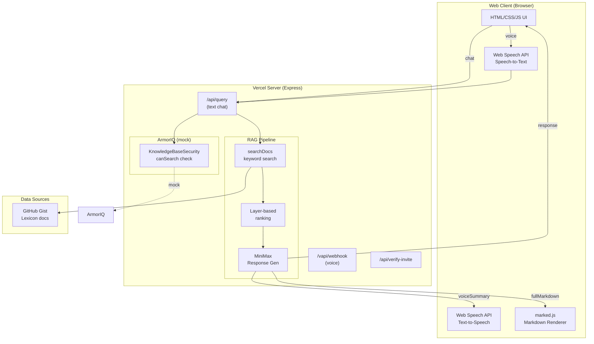

# Oculory Architecture

Voice agent over a Lexicon knowledge base.

## Overview

Oculory is a voice-enabled Q&A system that answers questions from a user's Lexicon data. Users can interact via text chat or voice (via VAPI), getting conversational responses backed by a RAG pipeline.

## System Diagram



## Components

| Component | Role |
|-----------|------|
| **Web Client** | Invite code → chat UI with text input + mic button. Renders markdown, plays TTS. |
| **VAPI** | Voice webhook - receives voice, returns spoken response |
| **RAG Pipeline** | Search docs → rank by layer priority → MiniMax generates response |
| **MiniMax** | Generates both: (1) short voice summary (~30 words), (2) full markdown answer |
| **ArmorIQ** | (Mocked) Security layer - `canSearch(userId, query)` returns `{allowed, reason}` |
| **Gist** | Private GitHub gist stores Lexicon documents as JSON |

## Data Flow

1. **User submits query** (text via input, or voice via mic)
2. **ArmorIQ check** - validates user can search for this query
3. **Search** - keyword match against all docs, scored by layer priority
4. **Generate** - MiniMax receives context (top 5 docs, 1200 chars each)
5. **Return** - `voiceSummary` for TTS/VAPI, `fullMarkdown` for chat display

## Layer Priority (RAG)

```
Memory (0) → People (1) → Meetings (2) → Metadata (3) → Transcripts (4)
```

Higher layers (lower numbers) are preferred in search results. Documents in earlier layers are ranked higher when scoring matches.

## APIs

| Endpoint | Method | Purpose |
|----------|--------|---------|
| `/` | GET | Serve HTML UI |
| `/api/verify-invite` | POST | Validate invite code (`HACK2026`) |
| `/api/query` | POST | Text chat - returns `{response, voiceSummary, sources}` |
| `/vapi/webhook` | POST | Voice - returns `{response}` for VAPI |

## Response Format

The `/api/query` endpoint returns:

```json
{
  "success": true,
  "query": "question asked",
  "response": "full markdown answer",
  "voiceSummary": "short summary for TTS (~30 words)",
  "sources": [{ "title": "doc title", "layer": "People" }],
  "security": "approved"
}
```

## Environment Variables

| Variable | Description |
|----------|-------------|
| `MINIMAX_API_KEY` | MiniMax API key for response generation |
| `VAPI_API_KEY` | VAPI webhook verification |
| `GIST_URL` | Private gist URL containing Lexicon documents |
| `ARMORIQ_API_KEY` | (optional) ArmorIQ API key |
| `PORT` | Server port (default 8080) |

## Tech Stack

- **Runtime**: Node.js / Express
- **Deployment**: Vercel
- **LLM**: MiniMax-M2.5
- **Voice**: VAPI + Web Speech API
- **Data**: GitHub Gist (JSON)
- **Security**: ArmorIQ (mocked)

## Future Improvements

- Real ArmorIQ integration
- Better RAG (embeddings + vector search)
- Multi-user / persistent sessions
- Voice conversation continuity
